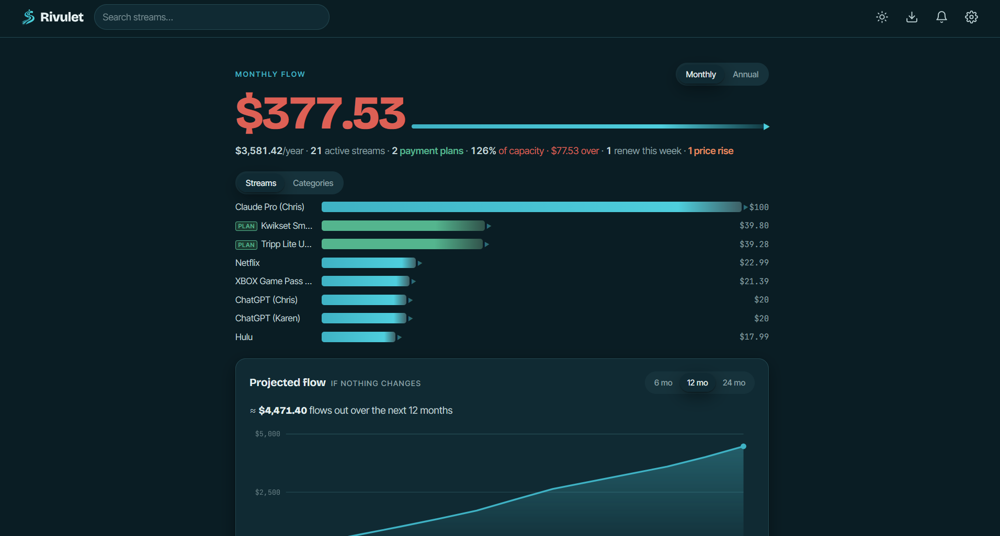

# Rivulet — Where Your Money Flows

A personal subscription tracker built around the idea that recurring spending is a set of streams draining away each month — not a budget to police, but a map of commitments to see clearly. Track subscriptions, utilities, and finite payment plans; watch your flow rendered as living bars that widen with cost; set an optional capacity ceiling; and project the exact amount leaving your account over the next twelve months. No build tools, no npm, no dependencies — just static files and a Cloudflare Worker backend for authentication and cross-device sync.

#### Demo:
https://your-username.github.io/rivulet

---

#### Screenshot


---

## Features

- **The flow hero** — your recurring spend as one animated figure and a set of draining bars, widest for the costliest stream; toggle between a **Monthly** run-rate view and an **Annual** projection of the next twelve months
- **Streams** — subscriptions, memberships, and any recurring charge, tracked with amount, billing frequency, category, next charge date, payment method, and cancellation-notice window
- **Payment plans** — finite, short-term recurring payments (financing, installments) tracked by *payments remaining* rather than an end date; the app computes the final payment date from the frequency and count, and the plan retires itself once it's paid off
- **Finite-aware annual math** — in Annual view, perpetual subscriptions count as twelve months of run-rate while payment plans contribute only the payments that actually fall within the next twelve months, so the yearly figure is the real amount you'll spend, not a naive ×12
- **Payment plans card** — a dedicated summary of every active plan: total still owed, and the monthly relief that returns to your flow as each plan finishes
- **At-a-glance plan markers** — payment plans carry a badge and a distinct green bar in the flow breakdown, so temporary drains read differently from perpetual ones
- **Capacity** — an optional personal ceiling (not a budget) to measure recurring flow against; surfaces as a percentage and headroom, with a three-band color cue on the flow figure. Set it per month or per year; the comparison follows whichever window you're viewing
- **Categories** — group streams into tributaries; click a category to scope the whole dashboard to it and see its share of your flow
- **Projected flow chart** — a cumulative SVG projection over a 6, 12, or 24-month horizon that correctly tapers as payment plans end
- **Upcoming charges** — everything billing in the next 30 days, sorted by proximity, with soon-to-renew highlighting
- **Reminders** — lead-time nudges for upcoming renewals, cancel-by deadlines (respecting each stream's notice period), trial endings, and recent price increases; optional once-a-day browser notification
- **Price history** — record a stream's price changes over time and see them as a small line chart, colored by direction (a rise reads as cost, a drop as reclaimed flow)
- **Leaks** — flags active streams you haven't used in a while, with the monthly amount you could reclaim
- **Multi-currency** — enter streams in any of several currencies; mixed portfolios are normalized to your display currency at approximate rates, clearly labeled as such
- **Quick-add templates** — start a stream from a library of ~43 popular services pre-filled with typical prices and categories
- **CSV import** — bring in many streams at once from a spreadsheet using the downloadable template; JSON backup export/import for a full round-trip
- **Three-tier accounts** — Guest (local only), Token (128-bit, KV-synced), or Google sign-in; one-way upgrade path from Guest → Token or Google, Token → Google
- **Cross-device sync** — token- or Google-based KV sync via Cloudflare Worker; pick up where you left off on any browser
- **Dark mode** — full light/dark theme with a deep-water dark palette; preference persisted, no flash on load
- **Motion** — count-up tweening, staggered reveals, and draining bars, all respecting `prefers-reduced-motion`
- **Mobile responsive** — collapsing layout tuned for phones

---

## File Structure

```
rivulet/
├── index.html              # App entry point
├── css/
│   └── styles.css          # All styles
├── js/
│   ├── app.js              # Client-side app logic, UI, sync orchestration
│   └── auth.js             # Portable three-tier auth module (Guest/Token/Google)
├── worker.js               # Cloudflare Worker (deploy separately)
├── rivuletimporttemplate.csv     # Column template for bulk CSV import
└── README.md
```

Rivulet is entirely dependency-free: there is no build step and no vendored libraries. Brand icons and favicons are inlined into `index.html` as base64 data URIs, so no image files travel with the app. The only external resources loaded at runtime are web fonts (Google Fonts) and, if Google sign-in is enabled, the Google Identity Services script — both from their CDNs.

---

## Setup

### 1. Get the files

Clone or download this repository. The app is entirely static — `index.html`, `css/styles.css`, and `js/*.js` are all you need to run it.

Open `index.html` directly in a browser for local, guest-only use, or host it on GitHub Pages (or any static host) for a permanent URL with sync.

---

### 2. Deploy the Cloudflare Worker

The Worker is Rivulet's backend. It verifies Google sign-ins, signs and authenticates token requests via HMAC, and provides the KV storage that backs cross-device sync. The app runs without it in local guest mode, but sync and Google accounts require it.

A free Cloudflare account is sufficient for personal use. The $5/month Workers Paid plan is recommended if you expect heavier usage or want higher KV read/write limits.

#### 2a. Create the Worker

1. Log in to [dash.cloudflare.com](https://dash.cloudflare.com) and open **Workers & Pages**.
2. Click **Create** → **Create Worker**.
3. Give it a name (e.g. `rivulet-worker`) and click **Deploy**.
4. Click **Edit code**, paste the entire contents of `worker.js` into the editor, and click **Deploy** again.
5. Note your worker URL — it will look like `https://your-worker-name.your-subdomain.workers.dev`.

#### 2b. Create a KV namespace

1. In the Cloudflare dashboard, go to **Workers & Pages → KV**.
2. Click **Create a namespace**, name it (e.g. `rivulet-kv`), and click **Add**.
3. Go back to your Worker → **Settings → Bindings**.
4. Click **Add** → **KV Namespace**.
5. Set the **Variable name** to exactly `RIVULET_KV` and select the namespace you just created.
6. Click **Deploy** to save the binding.

> **Why `RIVULET_KV`?** The worker references `env.RIVULET_KV` by that exact name. A different variable name will break every storage and auth route.

#### 2c. Set environment variables (Google sign-in only)

Token-based sync and guest mode need no configuration at all. If you want the Google account tier, add one variable in your Worker → **Settings → Variables and Secrets**:

| Variable | Type | Value |
|---|---|---|
| `GOOGLE_CLIENT_ID` | Text | Your Google OAuth Client ID |

Leave it unset to disable Google sign-in. No client secret is required — the Worker verifies Google ID tokens against Google's published public keys, so there is no code-exchange flow and no secret to store.

> **Note:** The Google Client ID is never embedded in the app source. The frontend fetches it at runtime from the Worker's `GET /auth/config`. Token-only and guest accounts don't need it at all.

#### 2d. Set up Google sign-in (optional)

Only needed if you want the Google account tier. Token-based sync works without any of this.

1. Go to [console.cloud.google.com](https://console.cloud.google.com) and open (or create) a project.
2. Under **APIs & Services → Credentials**, create an **OAuth 2.0 Client ID** of type **Web application**.
3. Add your app origins (e.g. `https://your-username.github.io`, `http://localhost:3000`) to **Authorized JavaScript origins**.
4. Copy the resulting Client ID into the Worker's `GOOGLE_CLIENT_ID` variable (2c above).

> Rivulet uses Google Identity Services in **popup** mode — no redirect URI registration is required.

#### 2e. Point the app at your Worker

1. Open the app in your browser.
2. Open **Settings** (gear icon).
3. Paste your Worker URL into the **Worker URL** field and save.

The app will begin routing authentication and storage operations through your Worker.

---

### 3. Accounts & Cross-Device Sync

Rivulet has three account tiers, with a one-way upgrade path (Guest → Token or Google, Token → Google):

- **Guest** — local only. Everything lives in this browser's localStorage. No Worker, no sync, no credentials.
- **Token** — a 128-bit cryptographic token (16 random bytes, base64url) is your identity in KV. Requests are HMAC-signed by the client and verified by the Worker; the raw token never travels as a bare bearer credential.
- **Google** — sign in with Google; the Worker verifies the ID token (RS256, against Google's published keys) on every request.

To sync a Token account to a new device:

- On your **primary browser**: open Settings, copy your **Sync Token**, and save it somewhere safe.
- On a **new browser or device**: open Settings, paste your token into the **Sync Token** field, and save. Both browsers now share the same KV data.

Legacy tokens generated before the current scheme are detected at boot and offered an upgrade; secondary devices migrate silently via a server-side forwarding pointer. A Token account can also be migrated to Google from Settings — the migration is HMAC-authenticated, so only the token's true owner can move its data.

---

## Worker Routes Reference

| Method | Route | Description |
|---|---|---|
| `GET` | `/` | Health check (open CORS) |
| `GET` | `/auth/config` | Return Google Client ID for GIS bootstrap |
| `POST` | `/auth/google` | Verify a Google ID token, return its KV key |
| `POST` | `/auth/verify` | Re-verify a stored Google credential at boot |
| `POST` | `/auth/migrate` | Token → Google migration (HMAC-authenticated) |
| `GET` | `/storage/:key/profile` | Read the app-data blob (410 / `X-Token-Migrated` on a migrated token) |
| `PUT` | `/storage/:key/profile` | Write the app-data blob (HMAC signed for token accounts) |

Token-account storage requests carry `X-Timestamp` and `X-Signature` headers (HMAC over the token, derived via HKDF); Google-account requests carry a `Bearer` ID token. Both are verified server-side on every call.

---

## Data Storage

All of Rivulet's data — your streams, categories, settings, price history, and reminders — lives in a single JSON blob in the browser's **localStorage**. The dataset is small and text-only, so it stays well within localStorage's per-origin ceiling.

When an account is synced, that blob is mirrored to **Cloudflare KV** under your user token (as `profile:<token>` for token accounts, or `profile:google:<sub>` for Google accounts). KV is the source of truth when both are present; the local copy is the cache and offline fallback. Nothing is stored server-side beyond what you save, and there are no passwords anywhere in the system.

---

## Design Notes

- **Not a budget.** Rivulet frames recurring spend as flow to observe, not a limit to enforce. Capacity is an optional ceiling for context, deliberately worded and colored to inform rather than scold.
- **Monthly is a snapshot, annual is a projection.** The Monthly view shows what's active right now at its run-rate. The Annual view shows the real total leaving your account over the next twelve months — which is why a finite payment plan with three payments left adds three payments to the year, not twelve, and a long plan is capped at the payments that actually fall inside the window.
- **Approximate FX, honestly labeled.** Cross-currency totals use a static rate table so mixed portfolios are meaningful at a glance. It's clearly marked approximate; single-currency portfolios never touch it.
- **Motion with restraint.** Every animation respects `prefers-reduced-motion` and falls back to an instant, static render.

---

## External Services & Libraries

| Service / Library | Used For | Key Required | Notes |
|---|---|---|---|
| Cloudflare Workers + KV | Auth, storage, cross-device sync | No (free tier) | Self-deployed; you own the namespace |
| Google Identity Services | Google sign-in (optional tier) | OAuth Client ID | Popup mode; ID tokens verified server-side in the Worker |
| Web Crypto API | HMAC request signing, JWT verification | No | Native browser API |
| Google Fonts | Display, body, and monospace typefaces | No | Loaded from the Google Fonts CDN |

No frameworks, no build step, and no vendored JavaScript libraries — the client is plain HTML, CSS, and JavaScript.

---

## License

See LICENSE file.
